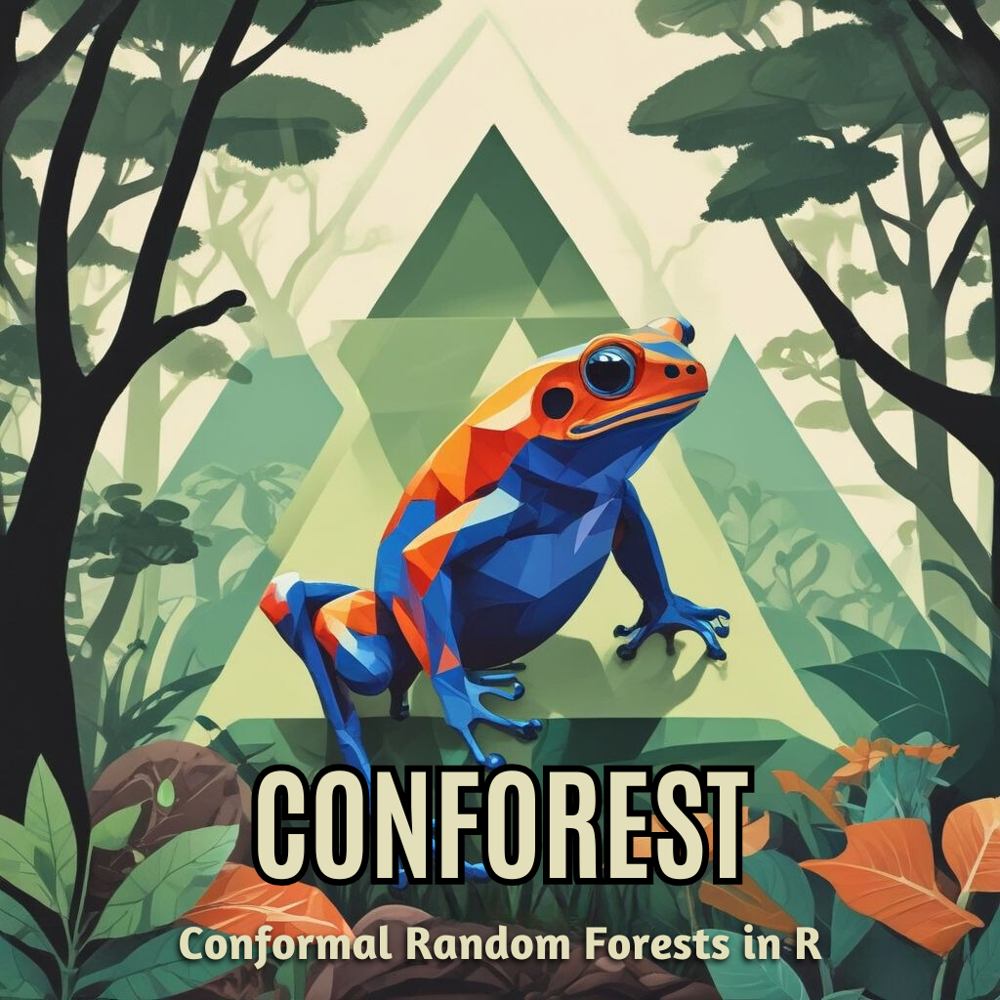

<!-- README.md is generated from README.Rmd. Please edit that file -->

# conforest: Conformal random forests

[](https://www.gnu.org/licenses/gpl-3.0)
[](https://github.com/knrumsey/conforest)

<div class="figure">


<p class="caption">
This logo was designed Magic Studio
</p>

</div>

### Description

<https://link.springer.com/content/pdf/10.1007/s10994-014-5453-0.pdf>

The `conforest` package is an efficient implementation of the method
referred to as RFoK, which fits a random forest (RF) using conformal
inference without needing a validation set. Instead, conformity scores
are estimated using out-of-bag instances. The nonconformity function for
observation $i$ is
$$\alpha_i = \frac{|y_i - \hat y(x_i|x_\text{oob})|}{\exp(\mu_i)+\beta}.$$
Where $\beta$ controls the sensitivity of the nonconformity measure
(with default `beta = sd(y)/30`) and $\mu_i$ is the $k$-nearest
neighbors estimate of $\log(|y_i - \hat y(x_i|x_\text{oob})|)$. The
prediction interval at a new location $x_j$ is given by
$$\hat y_j(x_j) \pm \alpha_C \exp(\mu_j + \beta),$$ where $\alpha_C$ is
the $C^{th}$ quantile of the observed conformity scores and $\mu_j$ is
the KNN estimate based on $x_j$’s nearest neighbors in the training set.

## Installation

To install the `conforest` package, type

``` r
# install.packages("devtools")
devtools::install_github("knrumsey/conforest")
library(conforest)
```

## Example Usage

``` r
library(conforest)
# Friedman function
f <-  function(x){
  10 * sin(pi * x[1] * x[2]) + 20 * (x[3] - 0.5)^2 + 10 * x[4] + 5 * x[5]
}  

# Generate data
n <- 200
p <- 3
X <- matrix(runif(n*p), nrow=n)
y <- apply(X, 1, f)

# Fit model
fit <- rfok(X, y)

# Plot Model
plot(fit)
```

## Reference

Johansson, U., Boström, H., Löfström, T., & Linusson, H. (2014).
Regression conformal prediction with random forests. Machine learning,
97, 155-176

### Copyright Notice

*2023. Triad National Security, LLC. All rights reserved.*

*This program was produced under U.S. Government contract
89233218CNA000001 for Los Alamos National Laboratory (LANL), which is
operated by Triad National Security, LLC for the U.S. Department of
Energy/National Nuclear Security Administration. All rights in the
program are. reserved by Triad National Security, LLC, and the U.S.
Department of Energy/National Nuclear Security Administration. The
Government is granted for itself and others acting on its behalf a
nonexclusive, paid-up, irrevocable worldwide license in this material to
reproduce, prepare. derivative works, distribute copies to the public,
perform publicly and display publicly, and to permit others to do so.*
